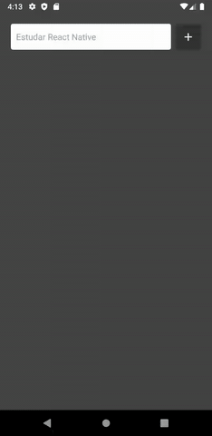

<p align="center">
  
</p>

<h3 align="center">
  To-do list com React Native
</h3>

## :rocket: Sobre o projeto
O objetivo desse projeto é exercitar o uso do React Native ao construir uma aplicação envolvendo os principais conceitos da tecnologia. Esse projeto foi submetido como uma tarefa de laborário na disciplina Computação Móvel.

## :memo: Sobre a aplicação
Essa é uma aplicação puramente front-end, ela faz uma listagem de atividades cadastradas pelo usuário. Essas atividades são registradas através de uma caixa de texto e podem ser removidas utilizando um botão ao lado da atividade listada. Utilizei a aplicação para aprender mais sobre animações em React Native, utilizei a biblioteca [`react-native-animatable`](https://github.com/oblador/react-native-animatable) para adicionar uma animação ao adicionar e ao excluir uma atividade.

<p align="center">
  
</p>

## :hammer: Tecnologias utilizadas
- React Native
- React Hooks
- [`react-native-animatable`](https://github.com/oblador/react-native-animatable)

## :wrench: Como testar a aplicação no seu computador
Primeiramente você deve clonar esse repositório em sua máquina, que nada mais é que baixar os arquivos aqui dispostos. Para isso, você pode baixar os arquivos clicando no botão verde escrito <em>Clone or download</em> e baixar o projeto como um arquivo ZIP (descompacte os arquivos em algum local do seu computador), ou pode clonar utilizando um terminal com git.

```bash
git clone http://github.com/pfreitasbarbosa/mobilefei-todolist
```

Depois, navegue até a pasta que você clonou o repositório e baixe as dependências do projeto executando o comando `yarn` (é necessário ter o programa [yarn](https://classic.yarnpkg.com/pt-BR/docs/install/) instalado em seu computador).

Para abrir o aplicativo em sua máquina é necessário ter o __React Native CLI__ instalado, você pode instalá-lo globalmente em sua máquina executando executando o comando `yarn global add react-native-cli`, depois de instalado você pode checar se tudo ocorreu bem digitando o comando `react-native -v`, e deve aparecer no seu terminal a versão do react-native-cli que foi instalado em sua máquina.

Com as dependências do projeto já baixadas, você pode abrir a aplicação de diversas formas, aqui estarei ensinando como inicializar ela em um simulador Android (para mais informações sobre como configurar um ambiente React Native, você pode acessar o guia fornecido pela Rocketseat [clicando aqui](https://react-native.rocketseat.dev/)).

Com o emulador aberto e com o terminal na pasta do projeto, digite o comando `react-native run-android` e aguarde o aplicativo ser instalado em seu emulador.

Caso ocorra um erro do tipo "Unable to load script. Make sure you're either running a Metro...", execute no terminal o comando `react-native start` e faça <em>reload</em> da aplicação apertando duas vezes a letra R ou clicando no botão 'RELOAD' no emulador.